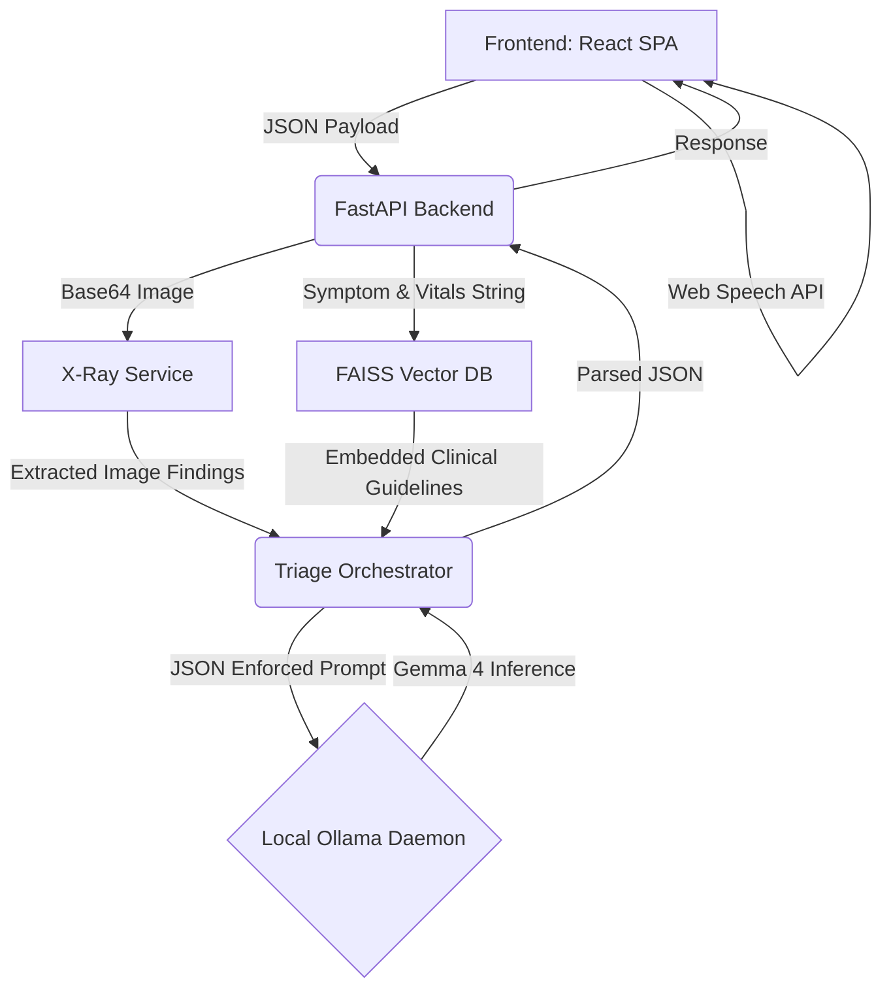

# Architecture of ER Gemma Vision

This repository follows a strict separation of concerns, enabling fully offline, local inference environments for emergency clinics.

## 1. System Topology

## 2. Component Layout

### A. The Presentation Layer (`apps/web/frontend`)
- **React + Vite**: Handles the UI routing sequentially (Landing -> Intake -> Processing -> Result).
- **Tailwind CSS**: Uses pre-configured generic medical coloring (`er-red`, `er-yellow`) to dictate urgency visually.
- **Web Speech API**: Intercepts native microphone functionality directly on the browser stringing it into the state.

### B. The Gateway and Routing (`apps/web/backend/api`)
- **FastAPI**: Highly concurrent router.
- **Pydantic Schemas (`models.py`)**: Responsible for enforcing that data drops from the UI (like Vitals, which contains `temperature`, `heart_rate`, `spo2`) are strictly typed before hitting the AI tools.

### C. The Core Intelligence (`apps/web/backend/services`)
- **`xray_service.py`**: Intercepts Base64 uploaded arrays from the frontend payload and bypasses standard LLMs by routing to a local Multimodal model (`LLaVA`). Translates images into text summaries.
- **`triage_orchestrator.py`**: The central brain. It compiles dynamic data into a rigid prompt template, queries the local FAISS DB for standard guidelines, and executes requests against `gemma`.
- **`core/prompts/`**: A library of system prompts utilizing the MIMIC-IV-ED dataset to form few-shot predictions enforcing the RED/YELLOW/GREEN schema output.

### D. The Offline Guardrails (`data/emergency_guides`)
We use retrieval augmented generation (RAG) strictly for physiological guidelines. Markdown files governing Trauma, Sepsis, and Chest pains are chunked via `scripts/ingest_docs.py` and converted to physical indices for local, offline searches.